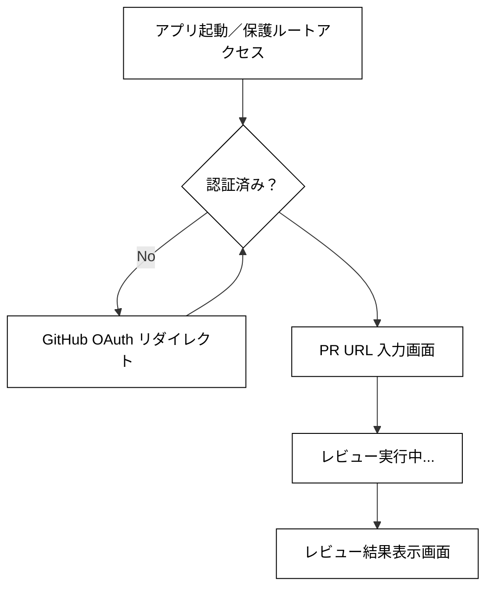

# 自動コードレビューシステム - 要件定義書

- [1. 背景と目的](#1-背景と目的)
- [2. ユーザー／ユースケース](#2-ユーザーユースケース)
- [3. 機能要件](#3-機能要件)
- [4. 非機能要件](#4-非機能要件)
- [5. 画面遷移](#5-画面遷移)
  - [5.1. 画面遷移の流れ](#51-画面遷移の流れ)
- [6. 画面イメージ](#6-画面イメージ)
  - [6.1. PR URL 入力画面](#61-pr-url-入力画面)
  - [6.2. レビュー結果表示画面](#62-レビュー結果表示画面)
    - [6.2.1. レビュー実行中](#621-レビュー実行中)
    - [6.2.2. レビュー実行後](#622-レビュー実行後)

## 1. 背景と目的

**背景**  
チームのコードレビューは時間がかかり、差分を見落としたり品質にばらつきが出る

**目的**  
PR の差分を AI で自動解析し改善ポイントを提示。レビュー時間を短縮し品質を安定化する


## 2. ユーザー／ユースケース

* **ユーザー**：GitHub アカウントを持つ開発者
* **主要ユースケース**：

  1. GitHub OAuth でサインイン
  2. PR URL を貼り付け（または「GitHub で PR を検索」から選択）
  3. 「レビュー」ボタンを押下して AI レビューを実行
  4. 画面内で「レビュー実行中…」を確認
  5. AI（ChatGPT）が返した改善ポイントを一覧で確認  
     - 各ポイントで「＋ Diff を表示」をクリックして該当箇所を展開

## 3. 機能要件

| No. | 機能           | 詳細                                                 |
| --- | -------------- | ---------------------------------------------------- |
| 1   | GitHub OAuth   | ユーザー認証とアクセストークン取得                   |
| 2   | PR URL 入力    | ユーザーが任意の PR URL を貼り付け                   |
| 3   | Diff 取得      | PR URL から `.diff` を取得                           |
| 4   | AI レビュー    | diffをChatGPT APIに送信し、改善ポイントを取得        |
| 5   | レビュー表示   | 返却コメントを箇条書きで表示                         |
| 6   | GitHubへの誘導 | PR URL 入力欄下に「GitHub で PR を検索」ボタンを配置 |

## 4. 非機能要件

* **アクセストークン管理**：サーバー側で安全に保管
* **レスポンス性能**：API呼び出し全体で数秒以内を目標
* **UI**：シンプル設計を維持しつつ、レビュー実行中は明示的な待機表示（スピナーまたはプログレスバー）を表示
* **テスト要件**：ユニットテスト、E2Eテスト、モックを用いたChatGPT APIテストの実装

## 5. 画面遷移



### 5.1. 画面遷移の流れ

1. **アプリ起動／保護ルートアクセス**  
   - アプリ起動または直接保護されたURL（PR 操作）へアクセスすると認証チェック。  
2. **認証チェック**  
   - 未認証なら GitHub OAuth へリダイレクトし、承認後に再度チェック。  
3. **PR URL 入力画面**  
   - ヘッダー右上に GitHub ログインユーザー名を表示。  
   - 入力欄に PR の URL を貼り付け、隣の「レビュー」ボタンを押下。  
   - 下部に「GitHub で PR を検索」ボタンも選択可能。  
4. **レビュー実行中**  
   - ボタン押下で「レビュー実行中…」表示に切替え。  
   - サーバーへ `pr_url` を渡し、Diff 取得／AI レビュー処理を実行。  
5. **レビュー結果表示画面**  
   - 改善ポイントの一覧を表示。  
   - 各ポイントで「＋ Diff を表示」をクリックすると、同一画面内で該当 diff 部分を展開。  


## 6. 画面イメージ

### 6.1. PR URL 入力画面

```
+──────────────────────────────────────────────────────────────────+
| GitHub PR Reviewer                             [👤 octocat]      |
|──────────────────────────────────────────────────────────────────|
| 🔗 PR の URL を入力 (例: https://github.com/octocat...) [レビュー] |
+──────────────────────────────────────────────────────────────────+
|                                                                  |
|                      [ GitHub で PR を検索 ]                      |
|                                                                  |
+──────────────────────────────────────────────────────────────────+
```

- 認証済みユーザーのみアクセス可能
- PR URL 入力欄を表示
  - プレースホルダーで入力形式を誘導
- 入力内容の形式チェックを行い、不正な場合はエラー表示
- 「レビュー」ボタンは URL が正しい形式のときのみ有効化
- 「GitHub で PR を検索」ボタンを表示し、GitHub の PR 一覧へ遷移
- ボタン押下時にサーバーへ `pr_url` を送信し、レビュー実行中表示へ移行

### 6.2. レビュー結果表示画面

#### 6.2.1. レビュー実行中
```
+──────────────────────────────────────────────────────────────────+
| GitHub PR Reviewer                             [👤 octocat]      |
|──────────────────────────────────────────────────────────────────|
| 🔗 PR の URL を入力 (例: https://github.com/.../pull/123) [レビュー] |
|──────────────────────────────────────────────────────────────────|
|                                                                  |
|      ┌──────────────────────────────────────────────────────┐    |
|      │                                                      │    |
|      │      🔄 レビュー実行中…Please wait                  │    |
|      │                                                      │    |
|      │             ●●●●●●●●●●●●●                         │    |
|      │             （アニメーションのローディングバー）      │    |
|      │                                                      │    |
|      └──────────────────────────────────────────────────────┘    |
|                                                                  |
+──────────────────────────────────────────────────────────────────+
```

- レビュー実行リクエスト受信後、自動的に「レビュー実行中」状態に遷移  
- 画面上部に PR URL 入力欄と「レビュー」ボタンを維持しつつ、操作不可とする  
- 「🔄 レビュー実行中…」のステータステキストを表示  
- ローディングインジケータ（スピナーまたはプログレスバー）を表示  
- 処理中は他の UI 操作（再レビューや検索）は受け付けない  
- バックエンドから結果受信後、即座に「レビュー結果表示画面」へ遷移  

#### 6.2.2. レビュー実行後

```
+──────────────────────────────────────────────────────────────────+
| GitHub PR Reviewer                             [👤 octocat]      |
|──────────────────────────────────────────────────────────────────|
| 🔗 PR の URL を入力… (例: https://github.com/.../pull/123) [レビュー] |
|──────────────────────────────────────────────────────────────────|
| 🔍 レビュー結果（改善ポイント）                                   |
|                                                                  |
| 1. 関数 initAuth() のエラーハンドリングを追加                    |
|    ・例外発生時にログ出力 & ユーザー通知を行う                   |
|    [＋ Diff を表示]                                              |
|                                                                  |
| ─── 折りたたみ ───                                              |
| @@ -10,7 +10,12 @@ function initAuth() {                         |
| -  // TODO: error handling                                       |
| +  try {                                                         |
| +    // 認証処理                                                  |
| +  } catch (e) {                                                 |
| +    console.error(e);                                           |
| +    notifyUser('認証エラーが発生しました');                     |
| +  }                                                            |
| ─── 折りたたみここまで ───                                      |
|                                                                  |
| 2. UI コンポーネントの再レンダリング抑制                         |
|    ・Memoization を導入してパフォーマンス改善                    |
|    [＋ Diff を表示]                                              |
|                                                                  |
| 3. テストケースの不足                                            |
|    ・AuthService のユニットテストを追加                         |
|    [＋ Diff を表示]                                              |
+──────────────────────────────────────────────────────────────────+
```

- レビュー処理完了後、自動的に本画面へ遷移  
- 改善ポイントを番号付きリストで表示  
  - 各項目に「＋ Diff を表示」を設置し、クリックで該当箇所を同一画面内に展開  
- Diff 展開部は必要に応じてスクロール可能な固定高さコンテナで表示  
- 画面上部に PR URL 入力欄と「レビュー」ボタンを常時表示  
- エラー発生時は画面最上部にエラーメッセージをバナー表示  
- 大量の改善ポイントがある場合はページネーションまたは「さらに表示」を実装  
- 必要に応じて「GitHub で PR を開く」リンクを設置し、元の PR ページへ遷移可能に  
